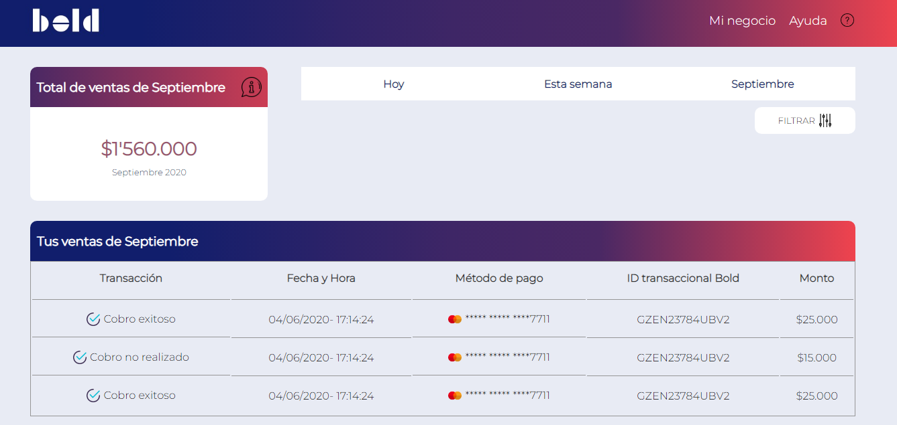

# Prueba Web Developer Luis Alvarez

Crear un Diseño Web Responsive Interactivo utilizando HTML, CSS, Javascript y React.js.  

## Objetivos del Proyecto

1. Maquetación de dashboard 
2. Creación de filtro de transacciones
3. El usuario puede seleccionar el botón “Hoy” o “Esta semana” o “Septiembre”
(cuando se selecciona el botón, se muestra con un color de fondo gris como
aparece en el diseño).

## Bold.co

    

